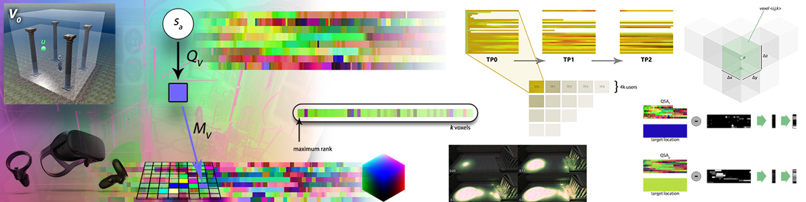

# PRISMIN


The PRISMIN (Processing and transfeR of Interaction States and Mappings through Image-based eNcoding) framework, allows to encode users' interaction states and mappings into compact and lightweight images, easily *manipulable* and *transferable* between remote peers in networked contexts.

The framework - based on [Node.js](https://nodejs.org/) - provides **Interaction Volumes** (`QVolume class`) as runtime accessories that can be arranged and deployed in virtual 3D scenes to capture or influence user interactions. **Prisms** (`Prism class`) can be used to *refract* interaction states and *bake* them into images.



The image-based approach offers GPU-friendly encoding/decoding routines and easy implementations for WebGL shaders to present and inspect captured data. Furthermore, different atlas layouts allows direct manipulation and offline processing using common 2D image algorithms to extract, combine or compare user interactions.

## Getting started
First install/update core library modules:
```
cd core/
npm update
```

Then, to install/update PRISMIN tools:
```
cd tools/<toolname>/
npm update
```

## Publications
Here are a few references (bibtex) to cite the research project:
```
@article{fanini2019vire,
    title={Encoding immersive sessions for online, interactive VR analytics},
    journal={Virtual Reality},
    author={Fanini, Bruno and Cinque, Luigi},
    doi={10.1007/s10055-019-00405-w},
    url={http://doi.org/10.1007/s10055-019-00405-w},
    issn={1359-4338},
    year={2019}
}

@inproceedings{fanini2019image,
    title={An Image-Based Encoding to Record and Track Immersive VR Sessions},
    author={Fanini, Bruno and Cinque, Luigi},
    booktitle={International Conference on Computational Science and Its Applications},
    pages={299--310},
    year={2019},
    organization={Springer}
}
```
